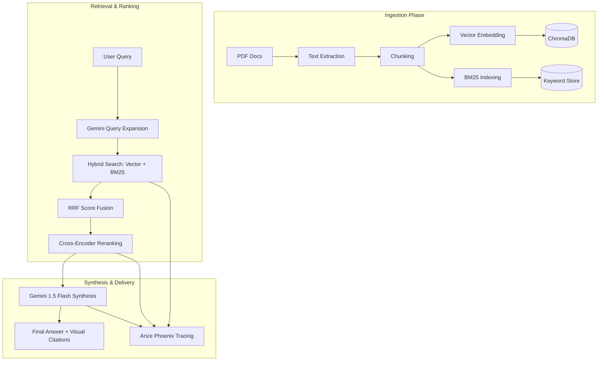

#  RAG Research Assistant


A professional, production-grade **Retrieval-Augmented Generation (RAG)** system designed for academic and corporate research. This assistant goes beyond basic RAG by implementing a 5-level architectural roadmap, including hybrid search, multi-query expansion, and real-time observability.

---

## 🚀 Architecture & Pipeline Flow

The project implements a state-of-the-art RAG pipeline that evolves through five levels of professional improvement.



### 🛠️ Step-by-Step Execution Flow

1.  **Document Ingestion**: PDFs are processed asynchronously. Text is extracted using `PyMuPDF`, split into overlapping chunks, and indexed in two parallel systems: **ChromaDB** for semantic meaning and **Rank-BM25** for exact keyword matching.
2.  **Query Expansion**: To improve recall, the system uses an LLM to rewrite a single user query into multiple variations, ensuring no relevant context is missed due to wording differences.
3.  **Hybrid Retrieval**: The system performs a dual-search. It fetches the most semantically similar chunks (Vectors) and the most keyword-relevant chunks (BM25).
4.  **Reciprocal Rank Fusion (RRF)**: A professional fusion algorithm merges the results from both search methods into a single, optimized ranked list.
5.  **Cross-Encoder Re-ranking**: The top candidates are re-scored by a specialized Cross-Encoder model. This adds a "second pair of eyes" to verify the relevance of each chunk against the query.
6.  **Synthesis**: The refined context is passed to Gemini 1.5 Flash, which generates a comprehensive answer with grounded citations.
7.  **Visual Verification**: The UI renders the specific PDF pages cited, allowing users to verify the information with their own eyes.
8.  **Observability**: Every single step above is traced in **Arize Phoenix**, providing full transparency into the AI's logic.

---


##  Key Features

- **🔍 Hybrid Search Engine**: Combines the semantic power of Vector Search (ChromaDB) with the keyword precision of BM25.
- **🧠 Intelligent Synthesis**: Analyzes your entire document library to find patterns and conflicting information across multiple PDFs.
- **👁️ Visual Citation**: Instantly render the exact PDF page mentioned in an answer for foolproof verification.
- **📡 Developer Tracing**: Live dashboard to monitor every detail of the AI's "thought process" using Arize Phoenix.
- **⚡ Async Architecture**: Built on a solid foundation of Python `asyncio`, making it ready for high-performance usage.

---

## 🛠️ Tech Stack

- **LLM**: Google Gemini 2.5 Flash
- **Vector DB**: ChromaDB (Local Persistent Storage)
- **Embeddings**: Sentence-Transformers (`all-MiniLM-L6-v2`)
- **Search Logic**: Rank-BM25 + Reciprocal Rank Fusion (RRF)
- **PDF Engine**: PyMuPDF (`fitz`)
- **UI Framework**: Streamlit (Premium Custom CSS)
- **Observability**: Arize Phoenix / OpenTelemetry

---

## ⚙️ Installation & Setup

### 1. Clone & Environment
```bash
git clone <your-repo-url>
cd rag-research_assistant
python -m venv venv
source venv/bin/activate  # Windows: .\venv\Scripts\activate
```

### 2. Install Dependencies
```bash
pip install -r requirements.txt
```

### 3. API Configuration
Create a `.env` file in the root directory:
```env
GEMINI_API_KEY=your_google_ai_studio_api_key_here
```

---

## 📖 Usage Guide

1.  **Launch the App**:
    ```bash
    streamlit run app.py
    ```
2.  **Index Documents**: Use the sidebar to upload one or multiple PDF research papers.
3.  **Monitor Traces**: Click the "Open Observability Dashboard" button in the sidebar to view live traces.
4.  **Ask Questions**: Type your research query in the main chat. The assistant will perform query expansion, hybrid search, and provide a synthesized answer with visual page citations.

---

## 🧪 Testing

The project includes a comprehensive test suite to ensure reliability:
- **Unit Tests**: `pytest tests/test_pipeline.py`
- **Functional E2E**: `python final_test_suite.py`

---

## 📄 License
Project developed for professional portfolio purposes. See `LICENSE` for details.
